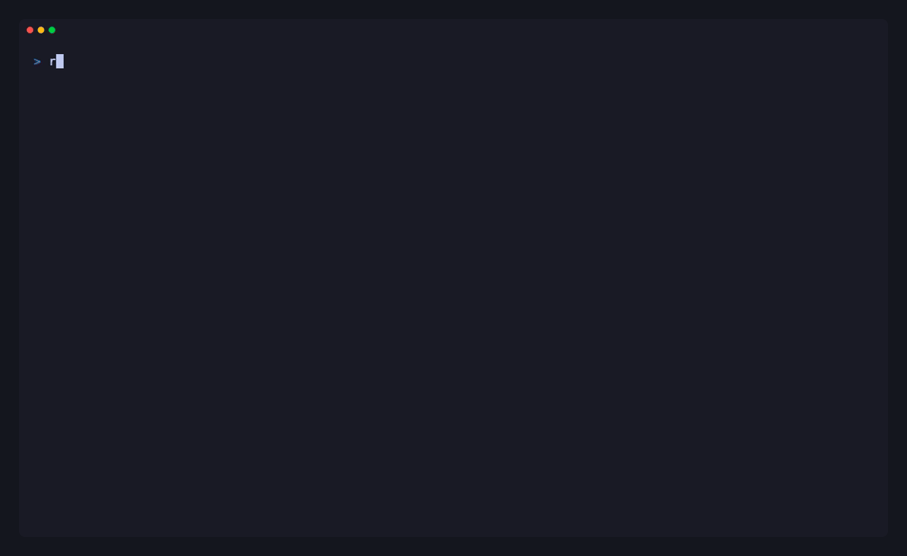

<p align="center">
  
</p>

<h1 align="center">revision</h1>

<p align="center">
  <a href="https://github.com/bapatchirag/revision/actions/workflows/ci.yml">
    
  </a>
  <a href="https://github.com/bapatchirag/revision/blob/main/go.mod">
    
  </a>
  <a href="https://github.com/bapatchirag/revision/blob/main/LICENSE">
    
  </a>
</p>

A lazygit-style terminal UI for Subversion (SVN). `revision` gives you a fast, keyboard-driven interface over the `svn` command line — review changes, stage with changelists, commit, update, and browse history without leaving your terminal.

<p align="center">
  
</p>

## Why

SVN's command line is powerful but verbose for day-to-day work. `revision` wraps it in a focused TUI — inspired by [lazygit](https://github.com/jesseduffield/lazygit) — so common tasks are a keystroke away. It shells out to your existing `svn` binary, so it respects your working copy, credentials, and configuration.

## Features

- **lazygit-style layout** — a left column of Status, Files, and Log panels beside a Main detail view, with number-key and `Tab` focus switching; scroll any panel on both axes, with scrollbars that show what's off-screen
- Working-copy **status** at a glance — changes colored by state, over a live repo/revision header
- Changed files as a **collapsible directory tree** — each change grouped under its folder, expanded or collapsed with `enter`
- **Colour-coded diff** viewer that follows your selection — additions, deletions, hunk headers, and metadata each tinted, with the `+`/`-` gutter pinned as you scroll; highlight a directory for the **combined diff** of everything beneath it
- **Staging** via a SVN changelist (a git-index-like workflow) — stage or unstage a single file, or a whole directory subtree, with one keystroke
- **Named changelists** — group the whole staged set (or just one file) in a tabbed Changelists view, drill into any list, and commit it as a unit
- **Commit** the staged set (or a chosen changelist) through an inline message editor
- **Update** the working copy to HEAD
- **Add / revert / delete** files, with confirmation prompts before anything destructive
- Read-only **log / history** viewer with full revision numbers and authors, plus per-revision detail (date, message, changed paths)
- **Filter or search any panel** with `/` — the Files and Log lists filter to matching rows (with `rev:` / `user:` / `state:` / `cl:` parameters plus free text over whole commit messages and paths), while the Main and Status views highlight matches in place and jump between them with `n` / `N`
- **Discoverable keybindings** — a contextual footer plus a full `?` help menu
- **Toast notifications** for every action, success or failure
- **Non-blocking authentication** — clear, actionable hints instead of a hung credential prompt

## Requirements

- The [`svn`](https://subversion.apache.org/) command-line client on your `PATH`
- Run `revision` from inside an SVN working copy (or pass `--path`)

## Install

`revision` is a single self-contained binary.

### Quick install (Linux / macOS)

```sh
curl -fsSL https://raw.githubusercontent.com/bapatchirag/revision/main/install.sh | sh
```

The script detects your OS and architecture, downloads the matching binary from the latest release, and installs it without `sudo` (falling back to `~/.local/bin`).

### With Go

```sh
go install github.com/bapatchirag/revision/cmd/revision@latest
```

### Prebuilt binaries

Download the binary for your platform from the [Releases](https://github.com/bapatchirag/revision/releases) page and put it on your `PATH`.

### Updating

> **Slated for v1.2.0.**

Release builds check for a newer version on startup. When one is available, `revision` shows a prompt offering to **update with cURL** (re-runs the install script), **update with Go** (`go install …@latest`), or skip it for now — pick one with the arrow keys and `Enter`, or press `Esc` to dismiss.

You can also update from the command line at any time:

```sh
revision --update                 # check, then prompt for a method
revision --update --update-with curl   # non-interactive: use the install script
revision --update --update-with go     # non-interactive: use go install
```

The update check and `--update` only run on official release builds; development and locally cross-compiled builds never check for or apply updates.

## Usage

```sh
# from inside an SVN working copy
revision

# or point it at a working copy
revision --path /path/to/working-copy
```

Flags:

- `--path <dir>` — working copy to operate on (default: current directory)
- `--version` — print version and exit
- `--update` — check for a newer release and update the binary (release builds only)
- `--update-with <curl|go>` — method for `--update` (default: prompt)
- `--help` — show help

### Keybindings

The footer shows the most common actions, and `?` opens the full keybindings menu at any time.

| Key | Action |
|-----|--------|
| `1` / `2` / `3` / `0` | Focus the Status / Files / Log / Main panel |
| `Tab` / `Shift+Tab` | Cycle focus between panels |
| `↑`/`k`, `↓`/`j` | Move the selection up / down |
| `g` / `G` | Jump to the top / bottom of a list |
| `K` / `J` | Scroll the Main panel up / down a page |
| `←`/`h`, `→`/`l` | Scroll the focused panel left / right (one column) |
| `Home` / `End` (`^` / `$`) | Jump to the start / end of the line in the focused panel |
| `[` / `]` | Switch the Files panel between the Changes and Changelists views |
| `space` | Stage / unstage the selected file — or every change under the selected directory (an untracked file is `svn add`ed first) |
| `n` | Assign the staged set — or just the selected file when nothing is staged — to a named changelist |
| `enter` | Expand / collapse the selected directory, or expand a changelist into its files |
| `c` | Commit the staged files, or the selected changelist (opens the message editor) |
| `r` | Revert the selected file (with confirmation) |
| `d` | Delete the selected file (with confirmation) |
| `u` | Update the working copy to the latest revision |
| `R` | Refresh status and history |
| `/` | Filter (Files/Log) or search (Main/Status) the focused panel; `n`/`N` jump between search matches (see [Filtering & searching](#filtering--searching)) |
| `D` | Toggle the directory-level diff for the highlighted directory (see [Configuration](#configuration)) |
| `t` | Open the theme picker |
| `S` | Edit application settings (see [Configuration](#configuration)) |
| `?` | Toggle the keybindings help |
| `q` / `Ctrl+C` | Quit |

In the commit editor, `Ctrl+S` submits and `Esc` cancels. In the changelist-name prompt, `Tab` toggles between typing a new name and picking an existing changelist. In a confirmation dialog, `Enter`/`y` confirms and `Esc`/`n` cancels.

### Filtering & searching

> **Slated for v1.2.0.**

Press `/` to narrow the focused panel. The query updates live as you type; `Enter` keeps it (the footer then shows it, with `Esc` to clear) and `Esc` clears it. The query is remembered per panel, so each panel can be narrowed independently.

The list panels (Files and Log) **filter** — non-matching rows are hidden. The detail panels (Main and Status) **search** — matching lines are highlighted in place, never removed: the current match is a reverse-video bar and the rest get a subtle highlight. Press `n` / `N` to jump to the next / previous match (the footer shows the position, e.g. `2/5`); if nothing matches, a toast says so.

Every query accepts free-text search over the whole panel, and the list panels add `key:value` parameters that can be combined in any order with the free text:

| Panel | Behavior | Parameters | Free text matches |
|-------|----------|------------|-------------------|
| Log | filter | `rev:` (exact revision), `user:`/`author:`, `path:` (a changed path), `date:` (`YYYY-MM-DD`) | the **full** commit message, not just its first line |
| Files (Changes / Changelists) | filter | `state:` (status code or name, e.g. `state:M`), `cl:`/`changelist:` | the file path |
| Main / Status | highlight + jump | — | the visible lines (e.g. searching within a diff) |

For example, focus the Log panel and type `rev:128 user:alice parser` to find revision 128 by alice whose message mentions “parser”; focus the Files panel and type `state:M app.go` to show only modified files whose path contains `app.go`; or focus the Main panel and type a word to jump between its occurrences in the diff with `n` / `N`.

## How staging works

SVN has no local staging index. `revision` emulates one using an SVN **changelist** named `revision:staged`: staging a file — or every change under a directory — adds it to that changelist, unstaging removes it, and `c` commits the staged set as a unit. This maps a git-like stage/commit flow onto native SVN.

You can also group work into **named changelists** with `n`: it moves the staged files (or just the selected file when nothing is staged) into a real SVN changelist, which appears in the Changelists view and can be committed on its own. A file belongs to at most one changelist at a time — unstage it (`space`) before moving it elsewhere.

## Configuration

> **Slated for v1.2.0.**

`revision` reads optional settings from `~/.config/revision/config.json` (or `$XDG_CONFIG_HOME/revision/config.json` when that variable is set). The file is optional: every setting falls back to a built-in default when the file, or an individual key, is absent.

You can edit these settings without leaving the app: press `S` to open the settings editor, adjust a value (`↑`/`↓` move between fields, `←`/`→` cycle the theme and toggle switches), then `Ctrl+S` to save or `Esc` to cancel. Saving writes the same `config.json`, and the theme and directory-diff changes apply immediately.

| Key | Type | Default | Description |
|-----|------|---------|-------------|
| `directoryDiff` | bool | `true` | Show the combined diff of every change beneath a directory when its row is highlighted. Set to `false` to turn directory-level diffs off globally; press `D` to reveal one on demand. |

Example `~/.config/revision/config.json`:

```json
{
  "directoryDiff": false
}
```

With `directoryDiff` set to `false`, highlighting a directory shows a short hint instead of its diff. Pressing `D` toggles the directory diff for the current session, so you can inspect one without changing the file.

## Authentication

`revision` always runs `svn` with `--non-interactive`, so it never blocks on a hidden credential prompt. If a command needs credentials that aren't cached, it fails fast with a clear hint instead of hanging.

Cache your credentials once by running an `svn` command yourself in the working copy (for example `svn info` or `svn update`). SVN stores them, and `revision` uses them on subsequent actions.

## Building from source

```sh
git clone https://github.com/bapatchirag/revision.git
cd revision
make build      # builds ./bin/revision
make test
```

Cross-compile static binaries:

```sh
make cross      # dist/revision-darwin-arm64 and dist/revision-linux-amd64
```

## Roadmap

`revision` already covers the everyday SVN workflow. On the horizon:

- **VS Code extension** — a bundled launcher that opens the TUI in an editor terminal, published to the VS Code Marketplace and Open VSX. The scaffolding exists but isn't ready yet.
- **More configuration** — the config file (`~/.config/revision/config.json`) already stores the color theme and the directory-diff toggle; planned additions include a default working-copy path, log limit, an external `$EDITOR` for commit messages, and keybinding overrides.
- **Theming** — selectable, user-customizable color themes loaded from that configuration.
- **Diff export & patching** — save a file's or a changelist's diff as a patch and apply one (`svn diff` → patch → `svn patch`), plus line- and hunk-level staging.
- **ssh-agent support** — seamless authentication for `svn+ssh://` working copies, alongside smoother handling of cached credentials.
- **Branches & tags** — create and switch between them as server-side copies (`svn copy` / `svn switch`).
- **More review tools** — blame / annotate, revision search and filtering, and conflict-resolution helpers.

Have an idea or want to help build one of these? Contributions are welcome.

## Contributing

Issues and pull requests are welcome — bug reports, feature ideas, and documentation fixes all help.

### Project layout

`revision` is a Go module with a layered, lazygit-inspired architecture:

- `cmd/revision` — the CLI entry point (flag parsing, working-copy detection, launching the TUI).
- `cmd/gallery` — a standalone gallery that renders each reusable UI component in isolation (`make run-gallery`).
- `internal/svn` — a thin wrapper over the `svn` binary that parses `--xml` output into typed values; always runs `--non-interactive`.
- `internal/tui` — the domain-agnostic UI foundation: reusable components plus theme, keymap, focus, layout, and messages. It must never import `internal/svn` or `internal/app` (a reusability-guard test enforces this).
- `internal/app` — the composition layer that adapts SVN data into components and arranges the lazygit layout. It is the only package that knows both sides.

### Development

```sh
make build        # compile ./bin/revision
make run          # run the TUI from source
make run-gallery  # preview the reusable components in isolation
make test         # run all tests
make lint         # run golangci-lint (must be installed)
make fmt          # gofmt the tree
```

Before opening a PR, please make sure `make fmt`, `make lint`, and `make test` all pass. New UI components should follow the existing contracts — compile-time interface assertions, a golden test over `View()`, and a teatest harness — and nothing under `internal/tui` may reach into the SVN or app layers.

Some tests drive a real `svn` binary against a throwaway repository; they skip automatically when `svn`/`svnadmin` aren't on the `PATH`.

### Regenerating the demo

The hero GIF is produced with [VHS](https://github.com/charmbracelet/vhs) from a scripted tape:

```sh
vhs docs/demo.tape   # writes docs/hero.gif
```

The tape builds a throwaway SVN working copy via `docs/demo-setup.sh`, so it needs `vhs`, `svn`/`svnadmin`, and a Go toolchain.

## License

[MIT](LICENSE) &copy; Chirag Bapat
